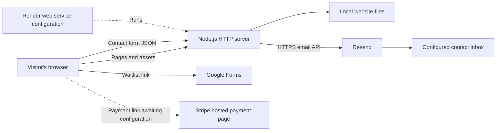

# Harmony Homes website

This repository contains the public website for **Harmony Homes Independent Living, LLC**, an independent living housing organization in Clarksville, Tennessee. Visitors can learn about the homes, review amenities and FAQs, join an external waitlist, open a payment link, and send a contact inquiry.

The app consists of ten HTML pages, one shared stylesheet, one shared browser script, local images, and a dependency-free Node.js server. The server serves the website and forwards contact inquiries to Resend for email delivery. Content is maintained directly in the repository.

This README describes the checked-in implementation. Hosting configuration and external links do not establish that the corresponding accounts, deployment, or delivery are active.

## Architecture and technology



| Layer | Implementation | Responsibility |
| --- | --- | --- |
| Page structure | HTML5 | Separate documents for each page, navigation, content, forms, and semantic page regions. |
| Presentation | Plain CSS | Shared colors, layouts, responsive behavior, buttons, cards, images, and form states. |
| Browser behavior | Plain JavaScript | Mobile navigation and asynchronous contact submission using browser APIs. |
| Runtime | Node.js `24.x` | Runs the HTTP server and supplies built-in `fetch`, `AbortSignal`, and test APIs. |
| Server | Native Node modules | `node:http` handles requests, `node:fs/promises` reads assets, and `node:path` / `node:url` resolve file paths. |
| Package commands | npm | Provides `npm start` and `npm test`; `package.json` is private and uses ES modules through `"type": "module"`. |
| Email transport | Resend HTTPS API | Receives a server-side request to send each accepted contact inquiry. |
| Hosting configuration | Render Blueprint YAML | Defines a Node web service, build/start commands, health check, and environment settings. |
| Automated checks | `node:test` and `node:assert/strict` | Exercise the HTTP server with mocked email delivery. |

There are no third-party npm dependencies or development dependencies. There is no frontend framework, bundler, transpiler, template engine, CSS framework, or generated frontend build. The browser receives the HTML, CSS, JavaScript, and images as stored on disk.

The repository does not implement a database, CMS, user accounts, resident login, administration dashboard, booking engine, payment ledger, background queue, analytics integration, or AI service. Room information is static content. The page labeled “Resident Payment Portal” contains an external payment button.

## Applications and external services

| Application or service | How this app uses it | Configuration and current repository status |
| --- | --- | --- |
| **Node.js** | Runs the site and contact endpoint locally or on a host. | `package.json` requires `24.x`; `server.js` is the entry point. |
| **npm** | Runs the two project scripts. | No application packages need installing for local execution. The Render build command generates a package lock. |
| **Resend** | Sends contact email through `POST https://api.resend.com/emails`. | Implemented in `server.js`. Requires `RESEND_API_KEY`, `CONTACT_FROM`, and `CONTACT_TO`; credentials and account verification are external setup. No Resend SDK or SMTP client is installed. |
| **Render** | Intended deployment target for the Node server. | `render.yaml` defines the `harmony-homes` web service with `runtime: node`, `plan: free`, and `/health`. A live deployment is not confirmed by this file. |
| **Google Forms** | Collects waitlist submissions after a visitor follows the button on `apply.html`. | The page contains a specific Google Forms URL, opening a new tab with `rel="noopener"`. There is no embedded form, Google API client, or response synchronization. Form access and response settings are managed outside this app. |
| **Stripe** | Intended destination for the payment button on `pay-rent.html`. | The URL is still `https://buy.stripe.com/REPLACE-WITH-YOUR-STRIPE-PAYMENT-LINK`. Replace it before using the payment feature. No Stripe SDK, checkout API, keys, webhook handler, or payment confirmation flow exists here. |
| **Email and telephone apps** | `mailto:` and `tel:` links open the visitor's configured mail or phone application. | Public contact details are repeated in the HTML. Direct email links bypass the contact API. The receiving mailbox provider is not identified in this repository. |
| **Domain and DNS provider** | Supplies website domain records and email-domain verification records. | Public pages reference `www.harmonyhomeslivingllc.com`; the registrar and DNS provider are not specified. DNS management happens outside the app. |

No additional runtime service is required by the checked-in code. The older mention of PayPal in `harmony_homes_site/README.txt` is an alternative suggestion, not an implemented integration.

## Repository layout

```text
.
|-- README.md                    Main architecture, setup, and operations guide
|-- package.json                 Node version, ES-module mode, and npm scripts
|-- server.js                    Static server, health endpoint, and contact API
|-- render.yaml                  Render web service Blueprint
|-- .env.example                 Environment-variable template without a key
|-- .gitignore                   Excludes local environment files and node_modules
|-- test/
|   `-- contact.test.js          HTTP and email-integration tests
`-- harmony_homes_site/          Public document root
    |-- index.html              Home
    |-- about.html              Organization and founder
    |-- rooms.html              Housing descriptions
    |-- amenities.html          Amenities
    |-- apply.html              External waitlist link
    |-- pay-rent.html            External payment link placeholder
    |-- foundation.html         Foundation coming-soon content
    |-- resources.html          Community-resource placeholders
    |-- faq.html                Native expandable questions and answers
    |-- contact.html            Contact details and inquiry form
    |-- styles.css              Shared styles and responsive layouts
    |-- script.js               Mobile menu and contact submission
    |-- README.txt              Older site notes; use this root README for setup
    `-- assets/                 Local PNG, SVG, and JPEG files
```

## Pages and user interface

| Page | Elements and behavior |
| --- | --- |
| [Home](harmony_homes_site/index.html) | Housing hero with a house background image and calls to action; four values covering safety, community, growth, and fresh starts; welcome copy with resident photographs; six amenity cards with inline SVG icons; and an About Us call to action. |
| [About Us](harmony_homes_site/about.html) | Organization overview, mission and vision, Mia Jackson's founder profile and portrait, and six C.A.R.I.N.G. values cards. |
| [Rooms](harmony_homes_site/rooms.html) | Two illustrated cards describing the Clarksville men's home and single/shared rooms, feature lists, and a waitlist link. Availability is not queried from a booking system. |
| [Amenities](harmony_homes_site/amenities.html) | Six cards for furnished rooms, cable/internet, kitchen, laundry, communal areas, and drug- and alcohol-free homes. |
| [Waitlist](harmony_homes_site/apply.html) | Introductory content and a “Join Waitlist Now” button linking to the configured Google Form. This server does not receive those answers. |
| [Payments](harmony_homes_site/pay-rent.html) | Payment introduction and “Click to Pay” button. Its Stripe URL remains a placeholder. |
| [Foundation](harmony_homes_site/foundation.html) | Coming-soon content describing planned foundation information. Donations and foundation programs have no application workflow here. |
| [Resources](harmony_homes_site/resources.html) | Placeholder cards for veteran support, employment, food, transportation, health/wellness, and reentry support, plus a notice to verify content. Served at `/resources.html`, but absent from the shared main navigation. |
| [FAQ](harmony_homes_site/faq.html) | Nine questions using native `<details>` / `<summary>` elements; the first is open initially. Expanding answers does not require JavaScript. |
| [Contact Us](harmony_homes_site/contact.html) | Contact-information card and labeled inquiry form with first name, last name, optional phone, email, and message fields, plus a hidden spam trap and live submission status. |

### Shared structure and styling

Each page includes a viewport declaration, page title, description metadata, `styles.css`, and a deferred `script.js`. Pages use a skip-to-content link, header, navigation, main content region, and footer. The header includes the PNG logo, contact links, a waitlist button, and a mobile menu button. Footer content includes location, telephone, email, website, copyright, and Equal Housing Opportunity text.

Headers, navigation, and footers are repeated directly in the HTML rather than generated from a shared component. The current navigation item is marked manually with an `active` class. Shared content changes therefore need to be applied across pages.

[styles.css](harmony_homes_site/styles.css) defines the current design:

- **Typography:** local Arial/Helvetica/system sans-serif fonts; no external font download. Headings use responsive `clamp()` sizes, bold text, and uppercase treatments.
- **Core colors:** blue `#128DC3`, green `#15920F`, yellow `#FFD500`, orange `#F58A00`, dark navy `#07152F`, and white `#FFFFFF`, plus soft backgrounds, text, border, and shadow variables.
- **Layout:** CSS Grid and Flexbox, a centered container up to 1200px wide, a sticky header, image/text sections, reusable cards, rounded corners, buttons, and callout bands.
- **Responsive breakpoints:** at 1050px and below, the menu collapses behind a toggle and layouts reduce columns; at 600px and below, many grids and form rows become single-column and buttons expand for small screens.
- **Icons and media:** home-page amenity icons are inline SVG; other decorative icons use text symbols. Photography and logos are served locally rather than through an image service.
- **Accessibility features:** image alternative text, a keyboard-visible skip link, labeled fields, autocomplete hints, native required-field validation, navigation labels, and a polite live region for contact status. These features do not establish that a full accessibility audit has been completed.

### Browser JavaScript

[script.js](harmony_homes_site/script.js) has two responsibilities:

1. The menu button toggles `.open` on the navigation and updates `aria-expanded` and the open/close accessible label.
2. The contact handler prevents normal form submission, checks browser validity, serializes `FormData` to JSON, and submits to `/api/contact`. It disables the button, marks the form busy, and displays progress while waiting. Success displays the server message and clears the fields. Failure displays an error and preserves the visitor's answers. The button is restored in either case.

The browser request has a 90-second timeout. The contact form requires JavaScript because the endpoint accepts JSON; a `<noscript>` message offers the phone number. The collapsed navigation also depends on the menu script.

### Image assets

| File under `harmony_homes_site/assets/` | Current use |
| --- | --- |
| `main-logo.png` | Header logo on all ten pages. |
| `house.jpg` | Home-page hero background and first room card. |
| `women-coffee.jpg` | Home-page welcome section. |
| `veterans-coffee.jpg` | Home-page welcome section. |
| `mia-jackson-headshot.jpg` | Founder portrait on About Us. |
| `men-community.jpg` | Second room card. |
| `women-sofa.jpg` | Included asset, currently unreferenced by the HTML/CSS. |
| `logo.svg` | Included alternative/placeholder logo, currently unreferenced by the HTML/CSS. |

## Server and API

[server.js](server.js) exports `createApp({ env, send, logger })`, returning a native Node HTTP server. Defaults are `process.env`, built-in `fetch`, and `console`; tests inject configuration and a fake email sender. When run directly, the file listens on `0.0.0.0` using `PORT`, defaulting to `3000`. Importing it for tests does not automatically start a listener.

### Routes and static files

| Route | Behavior |
| --- | --- |
| `/` | Serves `harmony_homes_site/index.html`. |
| `/index.html`, other `.html` pages, and asset paths | Accepts `GET` and `HEAD`, reads the corresponding file, and returns a MIME type based on its extension. `HEAD` omits the body. |
| `/health` | Returns HTTP 200 with `{"message":"OK"}`. It does not check Resend credentials or delivery. The implementation does not restrict its HTTP method. |
| `/api/contact` | Accepts a JSON `POST` and returns a JSON `message` describing success or failure. |

The document root is fixed relative to `server.js`. Only `.html`, `.css`, `.js`, `.svg`, `.png`, and `.jpg` files within that root are eligible for static serving. Path containment and extension checks keep root-level files such as `.env` and `server.js` outside the public file service. Other static-request methods receive 405. Missing files receive 404; malformed requests can receive 400. There is no extensionless page routing or single-page-app fallback.

All responses receive `X-Content-Type-Options: nosniff` and `Referrer-Policy: strict-origin-when-cross-origin`. JSON responses use `Cache-Control: no-store`. The static handler does not implement compression, ETags, or custom cache lifetimes.

### Contact request and validation

The form sends this shape:

```json
{
  "first_name": "Jane",
  "last_name": "Doe",
  "email": "jane@example.com",
  "phone": "",
  "message": "I would like more information about housing.",
  "website": ""
}
```

The endpoint checks the HTTP method, exact allowed `Origin`, JSON content type, a maximum 16,384-byte body, and valid JSON object structure. A nonempty `website` honeypot field rejects the request. Field limits are checked before trimming whitespace:

| Field | Maximum length | Rule |
| --- | --- | --- |
| `first_name` | 80 characters | String required and nonempty after trimming. |
| `last_name` | 80 characters | String required and nonempty after trimming. |
| `email` | 254 characters | String required; must match the server's basic email-address pattern. |
| `phone` | 40 characters | String required in the payload, but may be empty. The UI treats it as optional. |
| `message` | 5000 characters | String required and nonempty after trimming. |

Names and phone values are also rejected if they contain carriage returns, newlines, or null characters after trimming. Unknown fields do not become email headers or override the recipient.

### Email delivery flow

1. After validation, the server checks email configuration and its in-memory send limits.
2. It sends one HTTPS request to Resend, authenticated with the server-side `RESEND_API_KEY`.
3. The email uses `CONTACT_FROM`, sends only to `CONTACT_TO`, and sets the visitor's email as `reply_to`. The fixed subject is `New Harmony Homes website inquiry`. A plain-text body contains the name, email, phone (or “Not provided”), and message.
4. The provider request has a 15-second timeout. Success requires a successful Resend response containing an email ID. See the [Resend Send Email API](https://resend.com/docs/api-reference/emails/send-email) for the external API contract.
5. Provider errors, invalid responses, and network failures become a generic visitor-facing error. Server logs contain configuration guidance or recognized provider error codes, not submitted answers, credentials, or arbitrary provider error text.

Success means the provider accepted the email, not that it reached the recipient's inbox. There is no delivery webhook, automatic retry queue, or stored contact-message history. A timeout can leave delivery uncertain; retrying can produce duplicates because the app has no idempotency mechanism.

### Contact response codes

| Status | Meaning |
| --- | --- |
| `200` | Resend accepted the inquiry and returned an ID. |
| `400` | Invalid JSON, invalid fields, or a filled honeypot. |
| `403` | The request origin is not in `PUBLIC_ORIGIN`. |
| `405` | Method other than `POST`; response includes `Allow: POST`. |
| `413` | Request body exceeded 16 KiB. |
| `415` | Content type was not `application/json`. |
| `429` | An application send limit was reached; response includes `Retry-After`. |
| `502` | Provider request failed, timed out, or returned an invalid success response. |
| `503` | Required email configuration is missing. |

### Storage and safeguards

The app does not persist inquiries to disk or a database. Contact data passes through the server to Resend and the recipient's mailbox; waitlist data is submitted directly to Google Forms. Payment data would go to the external payment destination once its link is configured. This repository does not define retention policies for those external services.

Each server instance tracks provider-attempt timestamps in memory and permits at most **5 attempts per rolling minute** and **90 per rolling 24 hours**, globally across visitors. Failed provider attempts count. Validation/configuration failures do not consume a provider attempt. A limit response advertises a retry interval of 60 or 86,400 seconds depending on the limit reached.

Counters reset on restart/deploy and are not shared across instances, so they do not guarantee compliance with provider quotas. Origin checks and the honeypot are basic abuse deterrents, not authentication or bot-proof protection. Scaling or heavier traffic would require shared rate-limit state and stronger abuse controls.

## Environment configuration

Copy [.env.example](.env.example) to a root-level `.env` for local development. `npm start` loads it using Node's `--env-file-if-exists=.env` flag. Production settings belong in the host's environment configuration.

| Variable | Purpose | Default or example |
| --- | --- | --- |
| `RESEND_API_KEY` | Secret key used only by the server to send email. | Blank in `.env.example`; required for contact delivery. |
| `CONTACT_FROM` | Sender on a verified sending domain. | `Harmony Homes <contact@send.harmonyhomeslivingllc.com>` is the template value, not proof of verification. |
| `CONTACT_TO` | Fixed inbox receiving inquiries. | Template and Blueprint use `info@harmonyhomeslivingllc.com`; the server has no fallback recipient. |
| `PUBLIC_ORIGIN` | Comma-separated exact origins permitted to submit inquiries. | Defaults to `http://localhost:3000` when unset. Include scheme and any nondefault port; omit trailing slashes. |
| `PORT` | Server listener port. | Defaults to `3000`; hosting can supply its own value. |
| `NODE_ENV` | Deployment environment convention. | Blueprint sets `production`; application logic does not branch on it. |

`.gitignore` excludes `.env`, other `.env.*` files except `.env.example`, and `node_modules/`. Keep the API key out of browser files and version control. Environment changes require a server restart or redeploy.

## Run locally

Install Node.js 24, then open a terminal in the repository root. No dependency-install or frontend-build step is needed.

For first-time setup in PowerShell:

```powershell
Copy-Item .env.example .env
# Edit .env with your local settings before testing email delivery.
npm.cmd start
```

Use `npm start` in a shell where npm is available normally. On Windows, `npm.cmd` avoids PowerShell's script-execution-policy restriction on `npm.ps1`. Do not overwrite an existing `.env` when repeating setup.

Open `http://localhost:3000`. Static pages can be viewed without Resend credentials, but valid contact submissions return 503 until email is configured. Opening HTML directly or using a static Live Server does not run the contact backend. If you change `PORT`, update `PUBLIC_ORIGIN` to match the browser URL.

## Activate email

1. Create a Resend account and verify a sending domain you own, such as `send.harmonyhomeslivingllc.com`, using its DNS records. A sending subdomain can separate sending reputation from the main domain. Keep existing mailbox DNS records intact. Follow [Resend's domain verification guide](https://resend.com/docs/dashboard/domains/introduction).
2. Create a sending API key scoped to the domain and set `RESEND_API_KEY` in the root `.env` or hosting secrets.
3. Set `CONTACT_FROM` to an address on that verified domain and `CONTACT_TO` to the receiving inbox. The visitor's email becomes Reply-To rather than the sender.
4. Set `PUBLIC_ORIGIN` to the exact website origin, such as `https://www.harmonyhomeslivingllc.com`. Add other intentionally supported origins, including a Render URL if needed, as comma-separated values without trailing slashes.
5. Restart or deploy, submit a live inquiry, and confirm Resend's delivery logs and the receiving inbox/spam folder. Automated tests do not send email or verify account configuration.

The app's send limits are separate from your Resend account's plan and quotas. Check the account dashboard for its current limits.

## Deploy on Render

Deploy the full repository as a **Node Web Service** so the static pages and `/api/contact` run on the same origin. The public HTML directory alone is insufficient for the contact feature.

Import [render.yaml](render.yaml) as a Blueprint, or create a web service using these checked-in settings:

| Setting | Value |
| --- | --- |
| Service name | `harmony-homes` |
| Runtime | Node |
| Node version | `24.x` from `package.json` |
| Root directory | Repository root |
| Plan in Blueprint | `free` |
| Build command | `npm install --package-lock-only --ignore-scripts` |
| Start command | `npm start` |
| Health check | `/health` |

The build command generates a dependency lockfile; it does not compile or bundle the website. The Blueprint sets `NODE_ENV=production` and the default receiving inbox. `RESEND_API_KEY`, `CONTACT_FROM`, and `PUBLIC_ORIGIN` use `sync: false` and must be supplied through deployment configuration.

Add the custom domain in Render, update DNS records as directed, and include that exact origin in `PUBLIC_ORIGIN`. The Node app creates an HTTP listener; public HTTPS is handled by the hosting layer.

Render's free web services currently spin down after 15 minutes without inbound traffic and can take about a minute to wake, delaying the first page load. See [Render's free-service limits](https://render.com/docs/free) for current constraints. Hosting allowances and email-provider allowances are separate.

## Tests and verification

Run the existing suite from the repository root:

```sh
npm test
```

On Windows PowerShell, use `npm.cmd test` if script policy blocks `npm`. The script runs `node --test`; no additional test library is installed.

[test/contact.test.js](test/contact.test.js) starts local HTTP servers on automatically assigned ports, calls them with built-in `fetch`, and injects a fake Resend sender. Its four test cases cover:

- Serving the contact page, excluding root `.env` and server source from public access, and using the fixed recipient plus visitor Reply-To.
- Invalid fields, non-object input, foreign origins, the honeypot, oversized bodies, unsupported content types, and incorrect methods without invoking the provider.
- Missing configuration and provider failures returning errors rather than false success or sensitive provider text.
- The five-attempt minute limit returning 429 with `Retry-After` before another provider call.

Tests send no real emails. They do not verify browser layouts, mobile interactions, Google Form access, a live payment destination, DNS, production deployment, actual email delivery, the rolling-day limit, or every timeout path. For a release, check navigation and responsive pages in a browser, exercise contact success/error behavior, and verify external links with the intended accounts.

## Maintaining the site

| Change | Where to edit |
| --- | --- |
| Page text, housing information, or FAQ answers | Corresponding HTML page in `harmony_homes_site/`. |
| Phone, public email, footer, or navigation | Repeated markup across all ten HTML pages. Also review the fallback phone in `server.js` and `script.js` when changing contact details. |
| Colors, spacing, typography, or breakpoints | CSS variables and rules in `harmony_homes_site/styles.css`. |
| Logo and photos | `harmony_homes_site/assets/` and HTML/CSS references; update alternative text when the subject changes. |
| Waitlist destination | Google Forms button `href` in `harmony_homes_site/apply.html`. |
| Payment destination | Placeholder button `href` in `harmony_homes_site/pay-rent.html`. |
| Contact fields or validation | Keep `contact.html`, `script.js`, `server.js`, and related tests aligned. |
| Email sender/recipient and allowed origins | Local `.env` or hosting environment settings. Changing `CONTACT_TO` does not update visible HTML email links. |
| Deployment settings | `render.yaml`, `package.json`, and the hosting dashboard. |

The nested `harmony_homes_site/README.txt` contains older placeholder guidance and brand-color values. Use the current HTML/CSS and this root README as the implementation reference: the Google Form and PNG logo are already linked in the pages, while the Stripe link remains a placeholder.

## Known unfinished features and troubleshooting

The payment destination, foundation content, and community-resource directory need completion before their corresponding features can be treated as ready. The Resources page also needs a navigation entry if it should be discoverable from the menu. Live hosting, domain verification, form permissions, and email delivery require external account checks.

| Symptom | What to check |
| --- | --- |
| Pages load but contact returns 503 | Set all three required email variables and restart. `/health` can succeed while email is unconfigured. |
| Contact returns 403 | Match `PUBLIC_ORIGIN` to the browser's scheme, hostname, and port exactly; check `www`, alternate domains, and trailing slashes. |
| Contact returns 502 | Review the server's sanitized diagnostic and Resend dashboard for sender verification, key permissions, quotas, or connectivity. |
| Contact returns 429 | The server's minute or rolling-day attempt limit was reached. Failed provider attempts also count. |
| Success appears but no email is visible | Check Resend delivery status and inbox/spam folder; acceptance is not an inbox-delivery guarantee. |
| First request after inactivity is slow | Check whether the Render free service is waking from idle. |
| Payment button fails | Replace the Stripe placeholder with the intended hosted payment URL. |
| Mobile navigation or form behavior is missing | Confirm JavaScript is enabled and `script.js` loads successfully. |
| npm is blocked by PowerShell policy | Run `npm.cmd start` or `npm.cmd test`. |
